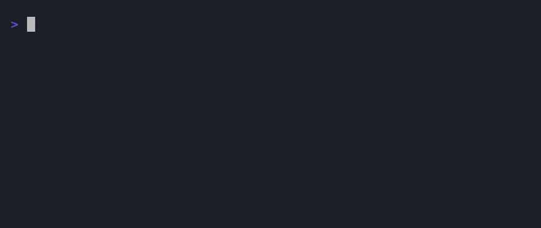

# testmap

[](https://pypi.org/project/testmap/)
[](https://pypi.org/project/testmap/)
[](#license)

A **feature × test-kind validation matrix** for your test suite.

<p align="center">
  
</p>

<p align="center"><i>Running <code>pytest --testmap</code> on a project tagged with <code>@testmap</code>.</i></p>

testmap answers a question code-coverage tools can't: **what validation evidence
do we have?** Coverage tells you which *lines* ran. testmap tells you which *kinds*
of test back each *feature*, and flags the required kinds that are missing.

```
Feature    Unit  Integration  Property  Perf  Status
----------------------------------------------------
parser        1            1         1     0       ✓
processor     1            1         0     0       ✗
sender        1            0         0     0       ✗

Missing:
  • processor: property
  • sender: integration
```

That output is useful for humans reviewing a PR, and for agents
("generate property tests for `processor`").

## Highlights

- A **matrix**, not a percentage. Features down the side, test kinds across the top.
- **Pluggable taxonomy.** Define your own kinds (`unit`, `integration`, `property`, `perf`, …).
- **Per-feature requirements.** Set a global default, override it per feature.
- **A pytest plugin** that tags tests with a `@testmap` decorator and collects them at zero runtime cost.
- **A standalone core + CLI** that ingests the metadata and renders the report. No pytest required to read it.
- **Agent-friendly JSON.** `--testmap-json` emits machine-readable records for tooling and LLMs.

## Installation

testmap ships as two distributions. Most users want the pytest plugin, which
pulls in the core automatically:

```bash
pip install pytest-testmap
# or
uv add pytest-testmap
```

If you only need to render a report from a JSON file (e.g. in CI), install the
standalone core on its own:

```bash
pip install testmap
```

## Usage

### 1. Tag your tests

Mark each test with the *feature* it exercises and the *kind* of validation it provides:

```python
from pytest_testmap import testmap

@testmap(feature="processor", kind="unit")
def test_processor_handles_empty_input():
    ...

@testmap(feature="processor", kind="integration")
def test_processor_round_trip():
    ...
```

### 2. Render the matrix

```bash
pytest --testmap
```

This prints the feature × kind matrix in the pytest terminal summary and flags
any required kinds that are missing.

### 3. Report without running the suite

Add `--testmap-only` to render the matrix from collected metadata without
executing a single test:

```bash
pytest --testmap-only
```

<p align="center">
  
</p>

### 4. Report without pytest at all

The standalone `testmap` core can discover `@testmap`-tagged tests by scanning
your source directly, so a report needs neither pytest nor a pre-generated file:

```bash
uvx testmap report          # scans testpaths from pyproject.toml
uvx testmap report src/     # or point it at a directory
testmap report --json       # machine-readable
```

### 5. Emit JSON for tooling

To split collection (in the test job) from reporting (in a separate step),
have the plugin write the raw records and feed the file to the CLI later:

```bash
pytest --testmap-json testmap.json    # collect
testmap report testmap.json           # render that file
```

## Configuration

The kind taxonomy and required kinds live under `[tool.testmap]` in `pyproject.toml`:

```toml
[tool.testmap]
kinds = ["unit", "integration", "property", "perf"]
required = ["unit", "integration"]   # global default

[tool.testmap.features]
processor = ["unit", "integration", "property"]   # per-feature override
docs = { exclude = ["perf"] }                     # opt a feature out of a kind

[tool.testmap.statuses]
complete = "✓"     # Status column symbol when a feature has every required kind
incomplete = "✗"   # ...and when it's missing one
```

`required` is the global default that every feature must satisfy; entries under
`[tool.testmap.features]` override it for a specific feature. An entry can be a
list of required kinds, or a table with `exclude` to drop kinds a feature
doesn't need — those show as `n/a` in the matrix and never count as missing.

The `[tool.testmap.statuses]` symbols shown in the Status column default to
`✓` / `✗`; override either independently (the table is optional).

## Packages

This is a [uv workspace](https://docs.astral.sh/uv/concepts/projects/workspaces/)
monorepo with two distributions:

- **`testmap`** (`packages/testmap`): standalone core + CLI. Ingests test
  metadata and renders the matrix / missing report.
- **`pytest-testmap`** (`packages/pytest-testmap`): pytest plugin. Provides the
  `@testmap(feature=..., kind=...)` decorator and the `--testmap` /
  `--testmap-json` options.

## Development

```bash
uv sync          # set up the workspace venv
make lint        # ruff format + ruff check + pyrefly
make test        # pytest with coverage
```

Commits follow [Conventional Commits](https://www.conventionalcommits.org).
Install the git hooks (lint, type-check, commit-message check) with
[`prek`](https://github.com/j178/prek):

```bash
prek install --hook-type pre-commit --hook-type commit-msg
```

## License

testmap is released under the MIT License.
</content>
